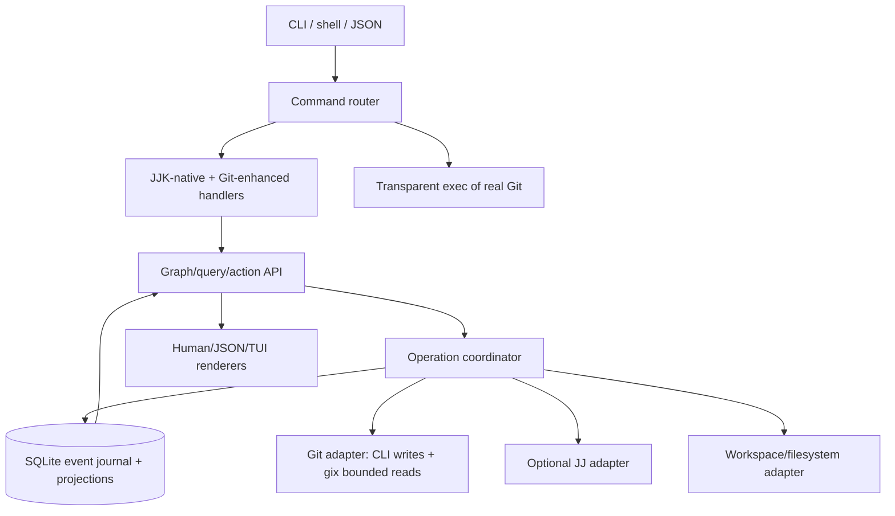

# JJK Architecture

## Decision

JJK v0.1 is one Rust package producing a reusable library and one `jjk` binary. It has three truths with strict ownership:

1. **Git** owns content objects, commits, refs, index/worktrees, remotes, and universal interoperability.
2. **Jujutsu**, when explicitly available, owns optional local change IDs and operation-log capabilities. Git-only mode is complete.
3. **JJK SQLite** owns append-only semantic events and transaction records. Materialized projections are disposable caches rebuilt from those events.

No layer impersonates another identity. A JJK state ID, Git object ID, JJ change/commit ID, attempt ID, workspace ID, operation ID, and mutable label are distinct types.

## Runtime shape



The binary is stateless between invocations except for `.jjk/`. No daemon is required for correctness. Future UI/IDE daemons are adapters over the same library and typed API.

## Mutation protocol

Every mutation follows one state machine:

`discover → lock → reconcile → resolve → plan → durable prepare → mutate Git/JJ/files → append events and update projections in one SQLite transaction → verify → commit/repair → unlock`

The operation journal records preconditions, intended effects, pre/post fingerprints, progress, verification, and recovery disposition. A crash before the external mutation rolls back metadata. A crash after an external effect uses fingerprints to complete forward or restore only bytes still matching JJK's recorded postimage. Externally changed data is preserved and reported as `recovery_required`.

## Command boundary

- JJK-native verbs are deliberately unlike Git: `save`, `step`, `nice`, `see`, `return`, `pick`, `fork`, `story`, `freeze`, `timeshift`.
- Git names are claimed only for deliberate enhancements. Stable v0.1 claims `status`; `init` is JJK-native initialization. `diff`, `log`, `push`, and `pull` remain native Git passthrough until separate enhanced contracts are implemented and proven.
- All other argv is transparently executed by the resolved real Git binary. This includes `clone`, `rebase`, `merge`, aliases, helpers, and future Git commands.
- Passthrough preserves original `OsString` arguments, cwd, environment, inherited stdin/stdout/stderr and TTY, signals, and exit status. It does not parse, normalize, reconcile, or post-process.

## On-disk contract

```text
.jjk/
├── store.sqlite3          # events, operations, projections, migrations
├── lock                   # cross-process writer/recovery lock
├── recovery/              # durable external-operation pre/post images
├── bundles/               # freezes and explicit backups
└── config.toml            # small human-editable policy/capability preferences
```

Internal Git refs use a versioned namespace such as `refs/jjk/states/<state-id>`. The schema and bundle manifest are versioned. A supported export/remove operation deletes only JJK-owned metadata/refs after preview and leaves a valid Git repository.

## Core graph

- A **state** is an immutable semantic capture backed by a Git commit/tree and one logical parent (except roots).
- An **attempt** is a line of exploration. It may have a Git branch and dedicated worktree but is not synonymous with either.
- A **workspace** is one checkout with exclusive mutation ownership/lease.
- A **composition edge** records a source state, source logical parent, derived patch identity, target base, conflict decisions, and result state. It is not ancestry.
- A **promotion** is an evidence-gated reversible update of a registered canonical ref.
- Archive/recover changes visibility and location metadata, never the immutable state fact.

Logical-parent edges form a DAG. Composition, provenance, validation, navigation, workspace, and promotion are typed edges/records with their own cycle rules.

## Read path

Orientation commands read a bounded SQLite projection and a small Git fingerprint/status query. They never traverse full history. Reconciliation is gated by Git common-dir/index/ref fingerprints and recorded watermarks. Graph queries are deterministic, paginated, and shared by all renderers.

## Compatibility strategy

Use the native Git CLI for mutation and behavior where Git is the authority; this preserves installed Git configuration, credential helpers, hooks, filters, signing, alternates, object format, and future command behavior. Use gix only for bounded, proven read acceleration behind interfaces with differential tests. Use JJ only through a capability adapter and never require it for stable workflows.

## Detailed decisions

- [`docs/architecture/event-model.md`](docs/architecture/event-model.md)
- [`docs/architecture/state-graph.md`](docs/architecture/state-graph.md)
- [`docs/architecture/transactions.md`](docs/architecture/transactions.md)
- [`docs/architecture/command-routing.md`](docs/architecture/command-routing.md)
- [`docs/architecture/git-jj-adapters.md`](docs/architecture/git-jj-adapters.md)
- [`docs/architecture/workspaces-agents.md`](docs/architecture/workspaces-agents.md)
- [`docs/architecture/migrations-backups.md`](docs/architecture/migrations-backups.md)
- [`docs/architecture/ux-ladder.md`](docs/architecture/ux-ladder.md)
- [`docs/architecture/testing-performance.md`](docs/architecture/testing-performance.md)
- [`docs/architecture/repository-structure.md`](docs/architecture/repository-structure.md)

## Non-goals for stable v0.1

No replacement Git implementation. No mandatory daemon or cloud service. No custom merge model pretending to solve semantic composition deterministically. No full Timeshift claim beyond implemented adapters. No GUI-specific semantic store. No auto-deletion of unique work. No stable command that is a placeholder.
