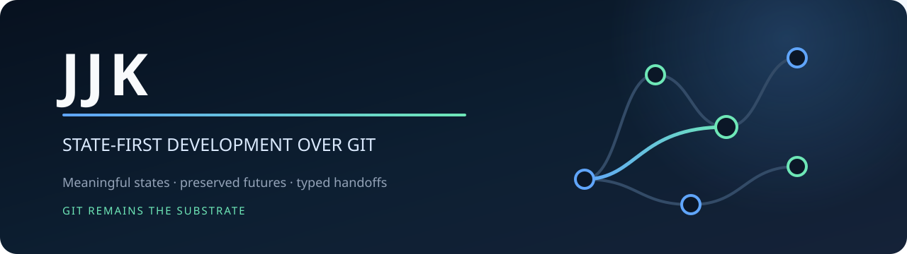
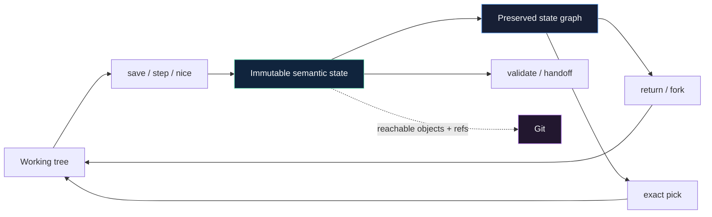
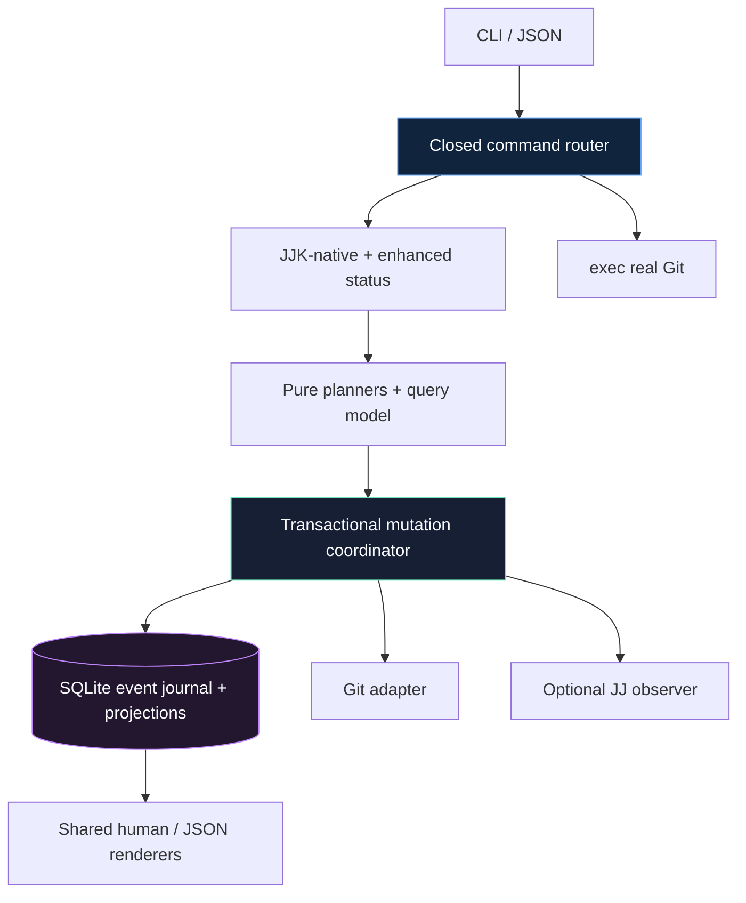
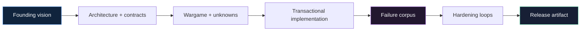

<div align="center">
  

# JJK

[](https://github.com/fire17/jjk/actions/workflows/ci.yml)
[](https://github.com/fire17/jjk/releases/latest)
[](Cargo.toml)
[](#git-stays-git)
[](LICENSE)
[](https://github.com/fire17/jjk/stargazers)

*Meaningful states. Preserved futures. Git still works.*

**[Quickstart](#quickstart)** · **[Why](#the-part-that-should-stop-you)** · **[Commands](#one-closed-command-boundary)** · **[Safety](#safety-and-undo)** · **[Architecture](ARCHITECTURE.md)**

</div>

> [!IMPORTANT]
> **Agents:** install JJK, run `jjk setup`, then use named checkpoints and typed handoffs. Read `jjk --help` from the exact installed build before automating flags.

```sh
curl -fsSL https://raw.githubusercontent.com/fire17/jjk/main/scripts/install.sh | sh
```

| When told… | Do this |
|---|---|
| “save this point” | `jjk save -- "factual description"` |
| “work in parallel” | `jjk fork --worktree --json -- "<agent-name>"` |
| “hand this to another agent” | validate exact content, then create a typed `jjk handoff` |
| “bring that change here” | inspect the handoff, then `jjk pick <state>` |
| “recover” | inspect `jjk doctor --json`; execute its exact remediation |

Three rules: the live command registry is authoritative; never invent flags from memory; every unclaimed command is real Git passthrough, not a hidden JJK approximation.

## The part that should stop you

**JJK can return to an earlier idea without deleting the future you left.**

- A capture is an immutable semantic state backed by a reachable Git object—not a mutable label pretending to be history.
- Returning from green to make orange preserves the earlier purple future as a sibling attempt.
- `pick` applies only the source parent→state delta. Picking “fast” onto orange yields orange+fast, never purple+fast.
- A conflicting pick pauses with a durable, inspectable operation; abort restores the complete Git/JJK preimage.
- Parallel agents get distinct attempts and worktrees, then cross an explicit validation + handoff + pick boundary.

> [!IMPORTANT]
> JJK makes exploration cheap without making history disposable.



## Quickstart

```sh
cd your-repository
jjk setup
jjk save -- "baseline before the change"
# edit files
jjk step -- "implemented one coherent slice"
jjk current
jjk see
```

That is the loop: **setup → save → change → step → current → see**. Use `jjk star [state]` to mark a memorable existing point without creating another snapshot, `jjk return <state>` to revisit a point, and `jjk pick <state>` to compose one exact delta.

## One closed command boundary

| Area | Commands | Contract |
|---|---|---|
| Enroll and capture | `setup`, `save`, `step`, `nice` | Create the safe space and record semantic states |
| Curate | `star`, `unstar` | Mark or unmark memorable existing states without changing their snapshots |
| Orient | `current`, `status`, `see`, `story` | Show location, Git truth, topology, and recovery state |
| Navigate | `return`, `back`, `forward`, `up`, `down` | Move without silently deleting alternate futures |
| Branch and compose | `fork`, `pick` | Create isolated attempts and apply one exact delta |
| Retain and recover | `archive`, `recover`, `undo`, `redo` | Hide without erasure; restore complete control state |
| Protect and move | `backup`, `load`, `freeze` | Verify, preview, and restore explicit recovery scopes |
| Collaborate | `validate`, `handoff` | Bind evidence and resume recipes to exact content |
| Operate | `doctor`, `completion` | Inspect integrity/capabilities and generate shell completion |

Use `jjk --help` and `jjk <command> --help` for the exact installed grammar. The registry that renders help is the registry that routes execution.

### Git stays Git

`status` is the only deliberately enhanced Git name. Every unclaimed invocation—including `init`, `clone`, `diff`, `log`, `fetch`, `rebase`, `merge`, `push`, aliases, and future verbs—executes the real Git binary with original argv bytes, cwd, environment, inherited stdio/TTY, signals, and exit status.

```sh
jjk rebase --onto main feature~3 feature   # real git rebase
jjk git -- status --porcelain=v1           # explicit passthrough escape
```

<details>
<summary><b>Parallel-agent protocol</b></summary>

1. Create one worktree per worker: `jjk fork --worktree --json -- "alpha"`.
2. Work only in the returned path and retain the typed attempt/workspace IDs.
3. Capture coherent changes: `jjk step -- "…"`.
4. Run `jjk validate` so evidence is bound to exact state content.
5. Create a typed handoff containing owner, objective, base/produced states, evidence, risks, and exact resume argv.
6. The integrator inspects the handoff and performs explicit `jjk pick`.
7. Conflicts remain durable until an explicit continue or abort action.

</details>

<details>
<summary><b>Recovery model</b></summary>

Every mutation follows one lifecycle:

`discover → lock → reconcile → resolve → plan → durable prepare → external effects → verify → atomic event/projection commit`

A crash before external mutation rolls metadata back. A crash after an effect uses recorded fingerprints to complete forward or restore only data still matching JJK's postimage. Externally changed bytes or refs are preserved and surfaced as `recovery_required`.

`backup` captures repository recovery scope. `freeze` creates a portable state bundle. Both are checksummed and fail closed on tampering. `load` requires a new destination and supports preview.

</details>

## Safety and undo

| Action | It touches | It never silently does |
|---|---|---|
| Install | One `jjk` executable in `JJK_INSTALL_DIR` | Edit shell startup files or repository state |
| `setup` | Shared JJK control data under the Git common directory | Change HEAD, index, files, refs, or user Git config |
| Capture/navigation | Declared Git/JJK state under a durable operation | Delete alternate futures, uncaptured untracked files, or ignored content |
| Git passthrough | Exactly the Git command invoked | Sandbox Git hooks, credentials, config, or filters |
| `archive` | Visibility metadata | Erase state topology or objects |
| `undo` / `redo` | Complete recorded Git + JJK control snapshot | Guess across external divergence |
| Uninstall | The installed executable | Delete JJK metadata, `.git`, branches, or worktrees |

```sh
sh scripts/uninstall.sh
```

## Architecture in one screen



Git owns content and interoperability. Optional Jujutsu owns only explicitly available local capabilities. JJK owns semantic states, attempts, provenance, navigation, validation evidence, operation recovery, and materialized projections. Read the full [architecture](ARCHITECTURE.md) and [acceptance contracts](CONTRACTS.md).

## Built by making failures first-class

The rewrite began with a forward-looking architecture, then wargamed the ways it could lie: byte-transparent passthrough, sibling futures disappearing, conflict abort changing the index, backups missing unreachable objects, restored paths changing workspace identity, and agents handing off untyped recipes.



| Layer | Receipt |
|---|---|
| Intent | [`VISION.md`](VISION.md) and verbatim [`origins.md`](origins.md) |
| Decisions | [`ARCHITECTURE.md`](ARCHITECTURE.md) plus `docs/architecture/` |
| Failure analysis | [`docs/wargame.md`](docs/wargame.md) and [`docs/unknowns.md`](docs/unknowns.md) |
| Contracts | [`CONTRACTS.md`](CONTRACTS.md) |
| Proof | Domain/property tests plus compiled CLI workflows under `tests/` |
| Distribution | Locked CI matrix, checksummed archives, SBOM, and provenance attestations |

Defects caught by that process included typed-ID transport mismatches, Git index stat-cache drift during conflict abort, missing staged-only objects in disaster bundles, destination-relative index restoration, and restored-workspace identity remapping. They became contracts, not release-note euphemisms.

## Trust is executable

The release gates run the locked all-feature test suite on Linux, macOS, and Windows. Separate quality gates run rustfmt and clippy with warnings denied. Release tags must match `Cargo.toml`; the workflow rebuilds and retests source, produces platform archives, per-archive SHA-256 files, a checksum manifest, an SPDX SBOM, and GitHub build-provenance attestations.

> [!NOTE]
> Optional JJ absence is a supported complete mode. Broken or mismatched JJ degrades loudly before semantic mutation; Git-only behavior remains available.

## Install options

### Verified release asset

```sh
curl -fsSL https://raw.githubusercontent.com/fire17/jjk/main/scripts/install.sh | sh
```

Pin version and destination:

```sh
JJK_VERSION=v0.4.1 JJK_INSTALL_DIR="$HOME/.local/bin" \
  sh scripts/install.sh
```

The installer downloads the matching archive and `.sha256`, verifies it, and installs only the executable.

### From source

```sh
cargo install --locked --git https://github.com/fire17/jjk --tag v0.4.1
```

Requires Rust 1.85+ and Git at runtime.

## Development

```sh
cargo test --locked --all-features
cargo fmt --all -- --check
cargo clippy --locked --all-targets --all-features -- -D warnings
```

## Explore without erasing

If preserving alternate futures, exact recovery, and honest agent boundaries belongs in the default workflow, star JJK so the state-first model remains easy to find.

[](https://star-history.com/#fire17/jjk&Date)

Related: [Termi](https://github.com/fire17/termi) · [bettercd](https://github.com/fire17/bettercd)

## License

[MIT](LICENSE)

<div align="center">
<sub><i>Git stores what happened. JJK remembers what it meant.</i></sub>
</div>
